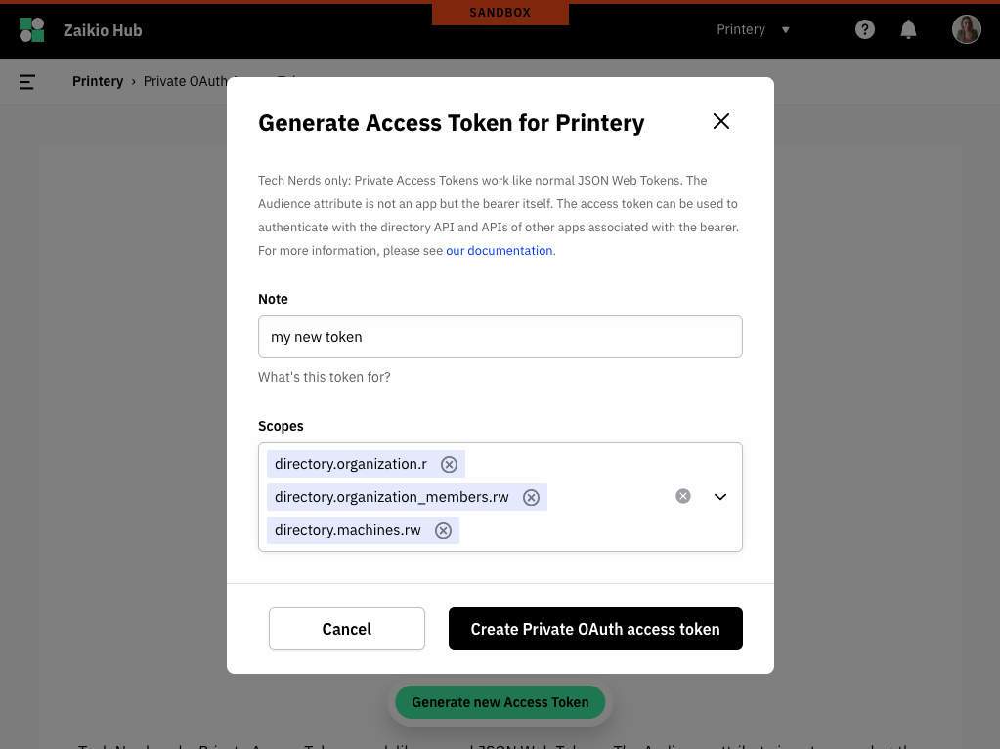
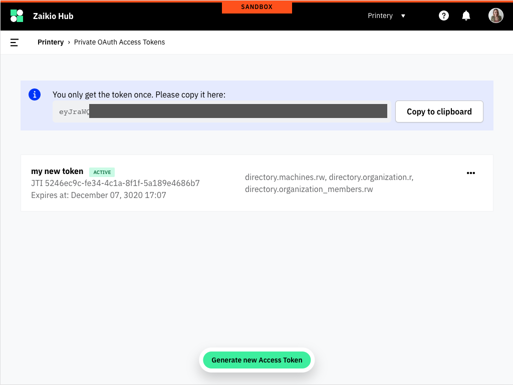
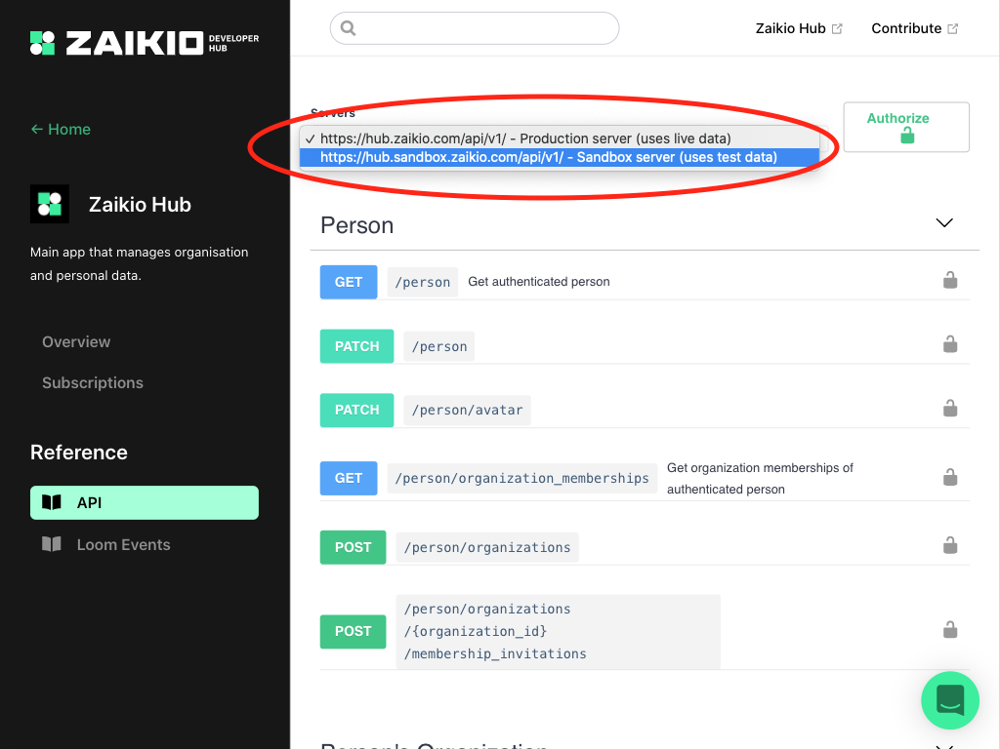
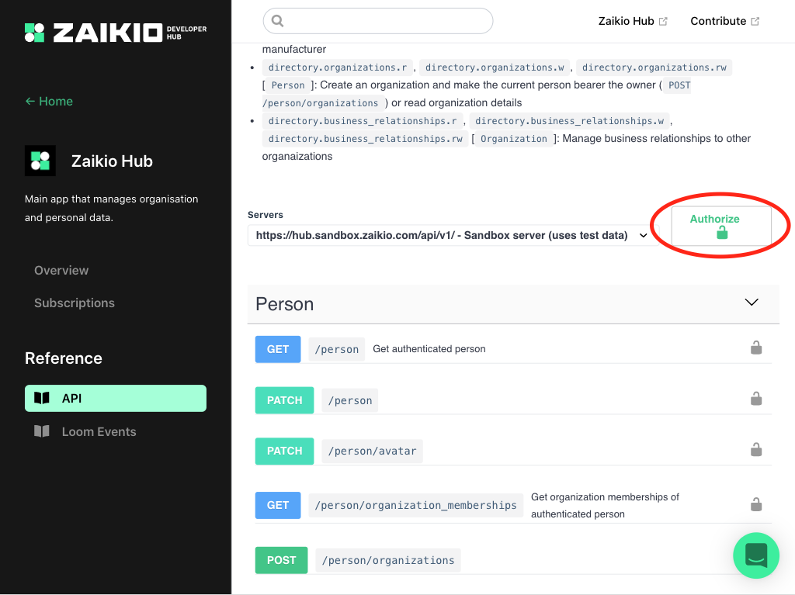
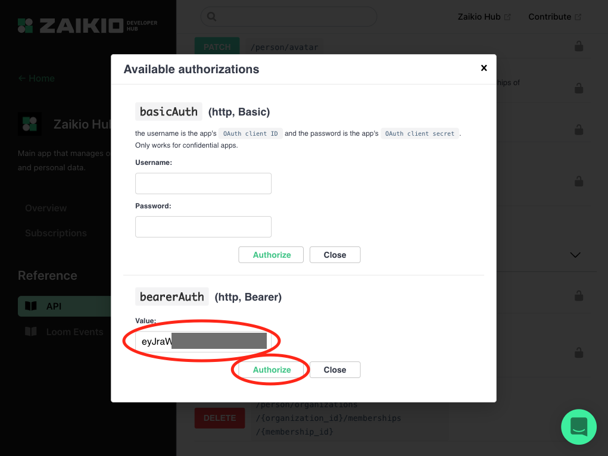
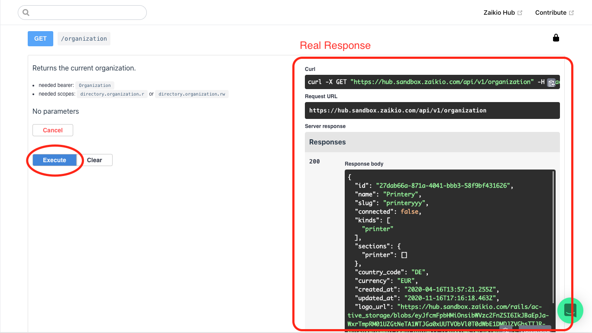

# Try Zaikio API

If you want a quick start to the Zaikio API, you can follow this guide.

## Step 1: Generate Private Access Token

To easily test the API, you can generate Private Access Tokens. These have the same structure as access tokens generated via Client Credentials Flow or Redirect Flow.

Access Tokens are issued either to a person or to an organisation. Depending on your use case, one or the other may make sense. In our [API reference](/api/directory) we define all Scopes and their Bearer Type. In this example we use a person token.

Log into the [zaikio sandbox](https://hub.sandbox.zaikio.com), choose an organisation, click on the `...` menu and select **Manage Private Access Tokens**. Then click on **Generate new Access Token**.

Select the scopes you want to share and generate the token. The generated access token will then be displayed once.

Copy the access token. The Access Token has to be treated as protected passwords. If you want to know what structure the JSON Web Token has, you can use our interactive [JWT Verifier](/guide/jwt/).

## Step 2: Use token in API Reference

Since our [API reference](/api/directory/directory.html) is **interactive**, you can copy the access token there. The access token is not stored.

If you use the access token for testing purposes, it probably makes sense to select the sandbox environment.

Click on **Authorize** in the upper right corner with the lock icon.

In the opening modal insert your access token under bearerAuth. Then click on **Authorize** and **Close**.

## Step 3: Try out an endpoint

Then open the endpoint you would like to test. Which endpoints you can now test is indicated by the black, closed lock icon.

Then click on the **Try out** button on the left. Specify the parameters, if there are any.

Then click on **Execute**.

Now you see on the right side the response to your request and the call in CURL. You can now easily test API requests this way.
